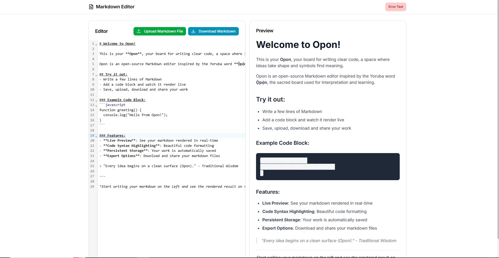

# Opon

A comprehensive, real-time Markdown editor and preview application built with React 19, featuring syntax highlighting, file operations, and persistent storage.


## Features

### Core Functionality
- **Real-time Markdown Preview**: Instant rendering as you type
- **Syntax Highlighted Editor**: Powered by CodeMirror for enhanced editing experience
- **File Operations**: Upload and download Markdown files
- **Auto-save**: Automatic local storage persistence
- **Responsive Design**: Works seamlessly on desktop and mobile

### Advanced Features
- **Error Boundary**: Graceful error handling with test route
- **Accessibility**: WCAG compliant with ARIA labels and keyboard navigation
- **Loading States**: Visual feedback during markdown parsing
- **404 Page**: Custom not found page for undefined routes

## Technology Stack

### Frontend
- **React 19** with functional components and hooks
- **React Router v7** for navigation
- **CodeMirror** for syntax-highlighted editor
- **marked.js** for Markdown parsing
- **DOMPurify** for HTML sanitization
- **Tailwind CSS** for styling
- **ShadCN/UI** components
- **Lucide React** for icons

### Architecture Decisions


#### Markdown Parsing
We use **marked.js** for its simplicity and performance:

```javascript
marked.setOptions({
  breaks: true,      // Convert \n to <br>
  gfm: true,         // GitHub Flavored Markdown
  sanitize: false,   // We use DOMPurify separately for security
});

// Security: DOMPurify prevents XSS attacks
const sanitizedHtml = DOMPurify.sanitize(parsedHtml);
# Installation & Setup

## Prerequisites
- Node.js 18+
- npm or yarn

## Quick Start

1. **Clone the repository**
   ```bash
   git clone https://github.com/your-username/markdown-preview-app.git
   cd markdown-preview-app ```

Install dependencies

``` bash
npm install ```

Start development server

```bash
npm run dev ```

Open your browser
Navigate to http://localhost:5173

Available Scripts
``` bash
npm run dev          # Start development server
npm run build        # Build for production
npm run preview      # Preview production build
npm run lint         # Run ESLint
npm run test         # Run test suite ```

Usage
Basic Editing
Start typing markdown in the left panel

See real-time preview in the right panel

Use Ctrl+S to download your markdown file

File Operations
Upload: Click the upload button to load .md files

Download: Click download to save your work as .md

Auto-save: Content automatically saves to local storage
nth-djzb-xnw

## Screenshots


Known Issues & Limitations:

Current Limitations
Large Files: Very large markdown files (>10MB) may cause performance issues

Code Block Languages: Limited to common programming languages for syntax highlighting

Offline Storage: Local storage limited to ~5MB per domain

Image Handling: Local images in markdown don't persist after refresh

Browser Compatibility:

✅ Chrome 90+

✅ Firefox 88+

✅ Safari 14+

✅ Edge 90+

Future Improvements:

Planned Features
Collaborative Editing: Real-time collaboration using WebSockets

Themes: Dark/light mode and custom syntax themes

Export Options: PDF, HTML, and DOCX export

Templates: Pre-built markdown templates

Version History: Track changes and revert to previous versions

Plugins: Extensible plugin system for custom markdown processors

Technical Improvements:

Progressive Web App: Offline functionality and installability

Performance: Virtual scrolling for very large documents

Testing: Comprehensive unit and integration tests

Internationalization: Multi-language support
